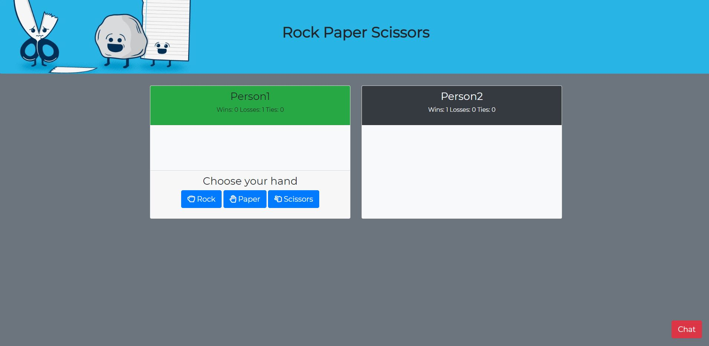

# Rock Paper Scissors Multiplayer

* Online multiplayer game created using a firebase database.
* Two players can play at a time. 
* The program will search for users after they enter their username.
* Chat ability with a button on the bottom right hand corner of the screen.
* Styling done with bootstrap and custom css.
* Ability to find a new opponent if the one you were playing with drops out. 

Deployed to https://noel3740.github.io/RPS-Multiplayer/

