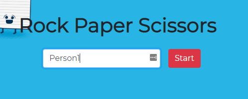
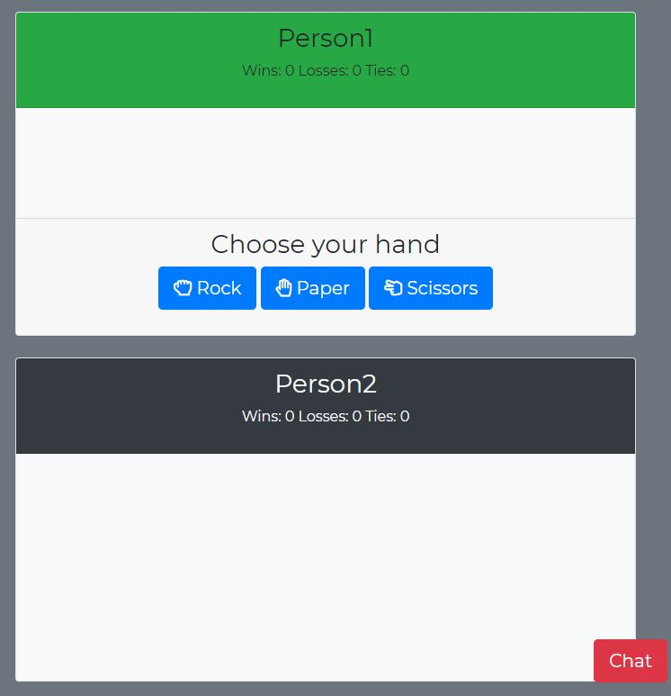
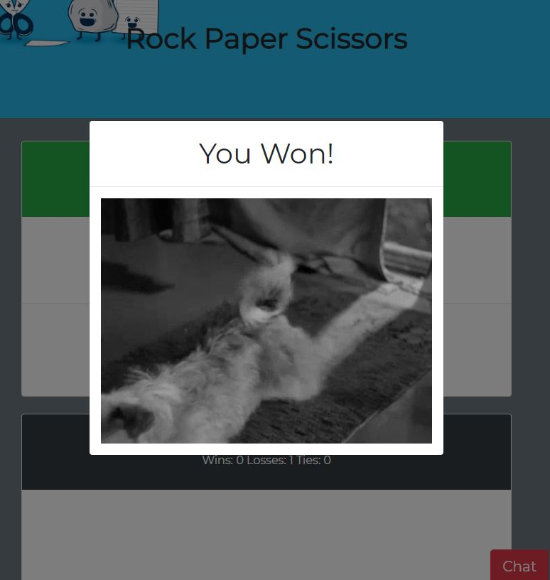
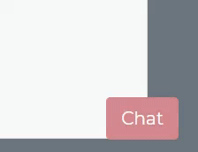
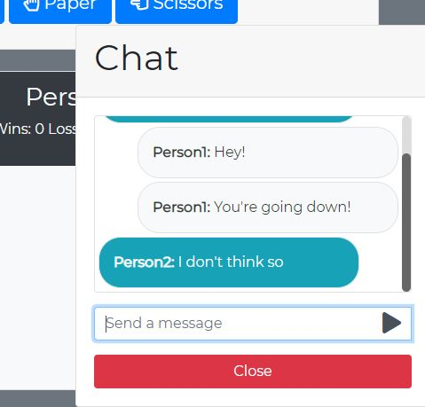

# Rock Paper Scissors Multiplayer

* Mobile friendly online multiplayer game created using a firebase database.
* Two players can play at a time. 
* The program will search for users after they enter their username.
* Chat ability with a button on the bottom right hand corner of the screen.
* Styling done with bootstrap and custom css.
* Ability to find a new opponent if the one you were playing with drops out. 

Deployed to https://noel3740.github.io/RPS-Multiplayer/

## Steps to play

1. Enter your username and press the start button.

    

2. Wait while the program searches for your human opponent.

    

3. When an opponent is found the searching overlay will disappear. Your username will be displayed in the green card along with your wins, losses, and ties. Your opponent's username will be displayed in the grey card with their wins, losses and ties. You will also be able to select the hand you want to play and chat with your opponent. 

    

4. Select the hand you would like to play. 
5. Once your oppoenent has chosen their hand you will see a modal popup with the result and a random gif. The popup will disappear after a few seconds and the results will be updated in your green card and your opponent's grey card. 

    

6. When you receive a chat message you will see the chat button on the bottom right hand corner of the screen glowing. Press the chat button to view the chat. 

    

7. When you press the chat button you will see the chat popup window. To chat enter your message in the `Send a message` text box and press the enter key on your keyboard or press the arrow button to the right of the `Send a message` text box. Messages will be updated within the popup in real-time. 

    